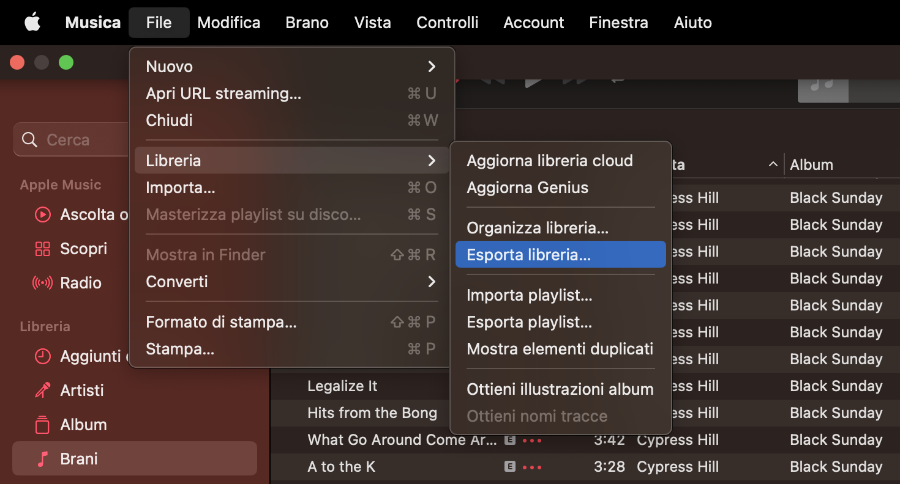

# Apple-Music-Library-Analysis

Do you ever have doubts about the accuracy of your streaming habits on Apple Music Replay? Fear not, because you now have the power to analyze your own library and create customized charts using this GitHub repository. Inspired by Jeff's article on Medium about [iTunes Library analysis using Pyhon](https://leojosefm.medium.com/python-analyzing-itunes-library-97bec60e13cb), I've taken the idea even further by developing a fully automatic pipeline for analyzing your music habits, made possible by the invaluable [music-library-exporter](https://github.com/kylekingcdn/music-library-exporter) script developed by kylekingcdn. With the following user-friendly instructions, you can dive right in and start exploring your Apple Music library in no time. 

## Installation
Your Apple Music library contains valuable information about your streaming habits, such as songs saved with play count, album and artist info, and more. This information can be exported as an XML file directly from the Apple Music app on your Mac, as shown below:




The play count is a key piece of information for analyzing your streaming habits. However, the XML file only provides the total number of times a song has been played up to the point of export. To analyze your streaming habits over time, you need to export the library multiple times (weekly, monthly, or even daily) and build a dataset of differences. Manually exporting the XML can be tedious, and unfortunately, Apple Music's native automation doesn't support library export. Fortunately, there are scripts like the one mentioned above called music-library-exporter, that can automate the process in combination with Chronjob. In the following section, we will describe a step-by-step process for extracting and analyzing your Apple Music Library over time.

To get started, clone this GitHub repo into a local folder using the command below:

```
git clone https://github.com/mirko-leccese/Apple-Music-Library-Analysis.git
```

This will give you a copy of the current GitHub repository, which includes the following content:

- ```export_library.sh```: a Bash script that runs the music-library-exporter and saves the exported XML files in a designated path.
- ```LIBRARIES```: a folder where you can store your exported XML files, organized by year subfolders.
- ```my_apple_music_library_analysis.ipynb```: a Jupyter Notebook that parses the XML files, builds a Pandas dataframe with streaming information, and produces simple but effective data visualizations to identify your most streamed songs or albums, your favorite artists, and more.

Once you've cloned the repo, follow the instructions provided by kylekingcdn to install their  ```music-library-export```(https://github.com/kylekingcdn/music-library-exporter). 

Open the ```export_library.sh``` and modify the absolute paths as necessary.

```bash
#!/bin/bash

# This script executes the "music-library-exporter" CLI to export the personal Apple Music Library to a given path. It can be
# automated with a Chron job to automatically extract the Library on a monthly basis.

# Defining main variable
current_extr=$( date +"%Y-%m-%d %H:%M:%S" )
current_date=$( date +"%Y-%m-%d" )
current_year_month=$( date -v-1d +"%Y%m" ) 
current_year=$( date -v-1d +"%Y" )


filename="music_library_$current_date.xml"
path="[YOUR_PATH]/Apple-Music-Library-Analysis/LIBRARIES/$current_year/"

# check if directory exists, create it if not
if [ ! -d "$path" ]; then
   mkdir -p "$path"
fi

# Export library
/Users/[YOUR_USER]/bin/music-library-exporter export --music_media_dir "[YOUR_MUSIC_LIBRARY_PATH]" --output_path "$path/$filename"

sleep 5

echo "-------------------------------------------------------------------------------------------"
echo "SUCCESS!! $current_extr: $filename correctly written to --> $path" | tee -a extraction.log
echo "-------------------------------------------------------------------------------------------"
```

Then, your are ready to schedule a Chronjob. Use the following command to open the chrontab:
```bash
crontab -e
```

This will open a text editor (```vi``` on Mac) where you can set up your schedule, e.g. to make the ```export_library.sh```run every Monday at 2:30 PM, add the following line to the crontab:

```bash
30 2 * * 1 cd /[YOUR_PATH]/Apple-Music-Library-Analysis && ./export_library.sh
```
After adding the line, save and close the crontab file. Your scheduled task is now set up and will run automatically according to the specified schedule.


